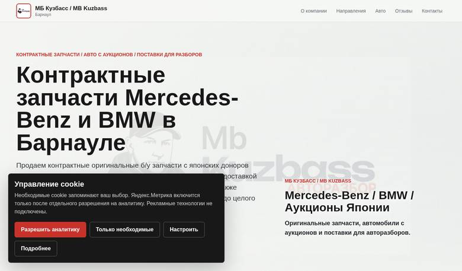
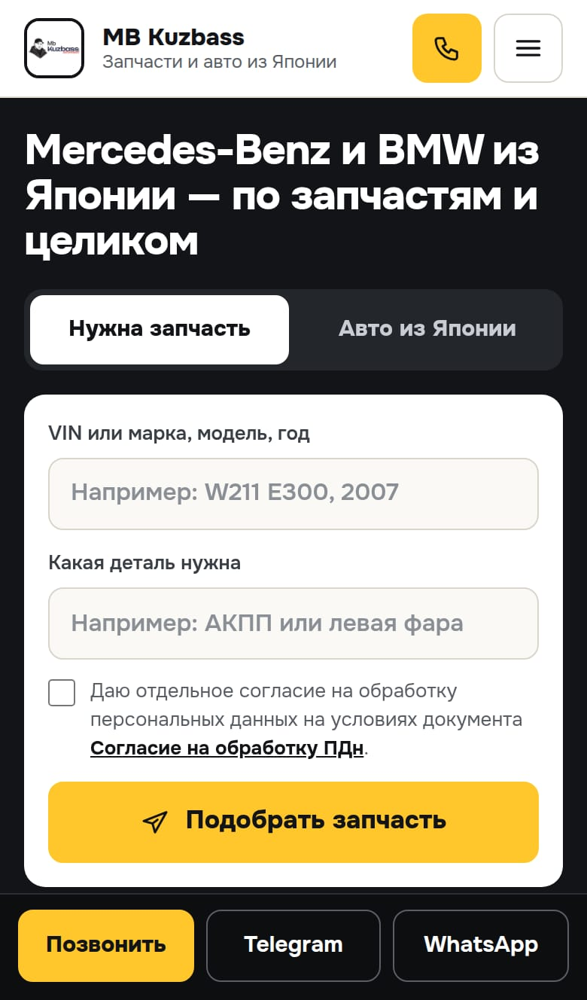
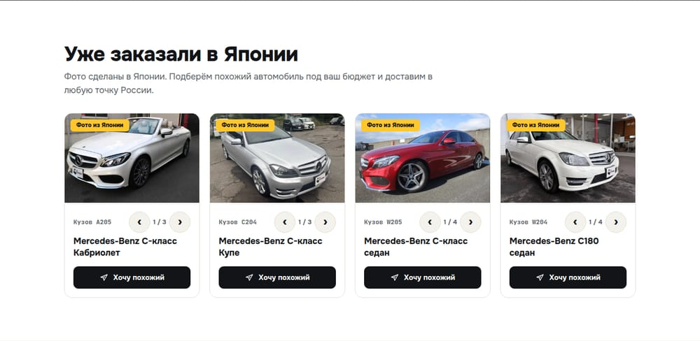

# 25. Как выглядит новая версия — 03.10.2026

Скриншоты сборки из ветки `claude/quirky-sagan-2c1jfk`: Chromium, компьютер 1440×900 и iPhone 13. Сделаны 03.10.2026 с локальной копии, потому что на mb-kuzbass.ru новая версия появится только после загрузки файлов на Спринтхост ([список](24-japan-cars-2026-10-03.md#загрузка-на-спринтхост)). «Было» — живой сайт 02.10.2026 ([отчёт 21](21-production-check-2026-10-02.md)).

Что изменилось и почему: [23 — новый дизайн главной](23-redesign-2026-10-03.md), [24 — «Уже заказали в Японии»](24-japan-cars-2026-10-03.md).

## Первый экран: компьютер

| Было (02.10.2026) | Стало |
|---|---|
|  |  |

## Первый экран: телефон

| Было (02.10.2026) | Стало |
|---|---|
|  |  |

## «Уже заказали в Японии»

На главной после раздела «Авто из Японии и поставки для разборов». На телефоне карточки листаются вбок, фото внутри карточки — стрелками.

Номера и таблички японских продавцов на фото заменены табличкой Mb Kuzbass:

| | |
|---|---|
|  |  |
|  |  |

Все 14 фото — в папке [`app/public/assets/japan`](../app/public/assets/japan).

## Страницы целиком

Длинные картинки, открываются в полном размере по ссылке:

- Главная: [компьютер](evidence/branch-2026-10-03/new-desktop-home.jpg), [телефон](evidence/branch-2026-10-03/new-mobile-home.jpg).
- `/avtomobili-iz-yaponii-barnaul/`: [компьютер](evidence/branch-2026-10-03/new-desktop-landing-japan.jpg), [телефон](evidence/branch-2026-10-03/new-mobile-landing-japan.jpg).

На скриншотах нет плашки cookie: выбор задан заранее, чтобы она не закрывала страницу. На сайте она появится при первом визите, как и раньше.
